# CI/CD Pipeline Documentation

This document describes the CI/CD pipeline setup for the project, including imported templates, defined stages, variables, and detailed explanations of each job.

## General configuration

```mermaid
%%{
  init: {
    'theme':'dark',
    'themeVariables': {
      'fontFamily': 'Inter, sans-serif',
      'primaryColor': '#3b82f6',
      'edgeLabelBackground':'#ffffff'
    }
  }
}%%

graph TD
subgraph External Templates [🦊 External CI Templates]
T1["📄 .pre.yml"]
T2["🔢 version.gitlab-ci.yml"]
T3["🐳 docker-build-push.gitlab-ci.yml"]
T4["🚀 helm-deploy.gitlab-ci.yml"]
end

subgraph External Config [📁 Config Repo]
CONFIG["🌿 Environment Configurations"]
end

subgraph Pipeline [🔁 Pipeline Flow]
LINT["🧹 Lint"]
VERSION["🔢 Version"]
BUILD["🛠️ Build"]
DOCKER["🐳 Docker"]
DEPLOY["🚀 Deploy"]
end

subgraph Rules [📐 Rules]
R1["📝 changes in CONTEXT_DIR/**/*"]
end

T1 --> LINT
T2 --> VERSION
T3 --> DOCKER
T4 --> DEPLOY

LINT --> VERSION
VERSION --> BUILD
BUILD --> DOCKER
VERSION --> DEPLOY
BUILD --> DEPLOY
DOCKER --> DEPLOY
CONFIG --> DEPLOY

R1 --> VERSION
R1 --> BUILD
R1 --> DOCKER
```





---

## Template Includes

The pipeline includes reusable GitLab CI templates from the shared DevOps repository `snx-devops/lib/ci-templates`:

```yaml
include:
  - project: snx-devops/lib/ci-templates
    ref: main
    file: gitlab/templates/.pre.yml
  - project: snx-devops/lib/ci-templates
    ref: main
    file: gitlab/templates/version.gitlab-ci.yml
  - project: snx-devops/lib/ci-templates
    ref: main
    file: gitlab/templates/docker-build-push.gitlab-ci.yml
  - project: snx-devops/lib/ci-templates
    ref: main
    file: gitlab/templates/helm-deploy.gitlab-ci.yml
```

These templates provide common reusable logic for:
- Pre-job configurations
- Semantic versioning
- Docker image build & push
- Helm chart deployment

---

## Pipeline Stages

```yaml
stages:
  - lint
  - version
  - build
  - docker
  - deploy
```

Each stage represents a logical step in the CI/CD workflow:

| Stage     | Description                                                  |
|-----------|--------------------------------------------------------------|
| `lint`    | Reserved for code linting or static analysis                 |
| `version` | Calculates and exposes Git-based versioning                  |
| `build`   | Builds the .NET application and optionally runs tests        |
| `docker`  | Builds and pushes the Docker image to the container registry |
| `deploy`  | Deploys the application via Helm to a Kubernetes environment |

---

## Variables

The pipeline uses a set of environment variables to customize behavior.

### Build Configuration

| Variable         | Description                           |
|------------------|---------------------------------------|
| `DOTNET_VERSION` | .NET SDK version (`8.0`)              |
| `TARGET_PROJECT` | Path to the main project file         |
| `TEST_PROJECT`   | Path to the test project file         |
| `CONFIGURATION`  | Build configuration (e.g., `Release`) |
| `RUN_TESTS`      | Flag to control test execution        |

### Docker

| Variable            | Description                                         |
|---------------------|-----------------------------------------------------|
| `IMAGE_NAME`        | Full Docker image name including registry           |
| `IMAGE_TAG`         | Tag for Docker image (uses version from GitVersion) |
| `CONTEXT_DIR`       | Docker context folder                               |
| `DOCKERFILE`        | Dockerfile path                                     |
| `REGISTRY_PASSWORD` | OAuth token for Yandex Container Registry           |
| `IMAGE_BUILD_ARGS`  | Custom build args including version metadata        |

### Versioning

| Variable    | Description                                        |
|-------------|----------------------------------------------------|
| `GIT_DEPTH` | Ensures full history is available for `GitVersion` |

### Helm Deployment

| Variable        | Description                                      |
|-----------------|--------------------------------------------------|
| `CHART_NAME`    | Name of the Helm chart                           |
| `CHART_PATH`    | Path to the Helm chart directory                 |
| `VALUES_FILE`   | Helm values file used during deployment          |
| `APP_VERSION`   | Application version for Helm deployment          |
| `CONFIG_REPO`   | Repository containing environment configurations |
| `CONFIG_BRANCH` | Branch to use from the config repository         |

---

## Default Image

The default image used for non-overridden jobs is:

```yaml
default:
  image: ubuntu:22.04
```

---

## Job Descriptions

### Version

```yaml
version:
  extends: .version_template
  script:
    !reference [ .version_template, script ]
  rules:
    - changes:
        - ${CONTEXT_DIR}/**/*
```

- Extends a shared versioning template.
- Executes only when relevant source code changes.

---

### Build

```yaml
build:
  stage: build
  needs:
    - version
  image: mcr.microsoft.com/dotnet/sdk:8.0
  before_script:
    - echo "Installing dependencies..."
    - apt update && apt install -y curl jq unzip ca-certificates

    - echo "Setting up certificates..."
    - cp .certs/ca.crt /usr/local/share/ca-certificates/
    - update-ca-certificates
  script:
    - dotnet --version

    - echo "Modifying NuGet.Config with credentials..."
    - sed -i 's/NUGET_SERVER_USER/'"$NUGET_SERVER_USER"'/g' $CONTEXT_DIR/NuGet.Config
    - sed -i 's/NUGET_SERVER_PASS/'"$NUGET_SERVER_PASS"'/g' $CONTEXT_DIR/NuGet.Config

    - echo "Restoring dependencies..."
    - dotnet nuget locals all --clear
    - dotnet restore "$TARGET_PROJECT" --configfile "$CONTEXT_DIR/NuGet.Config"

    - echo "Building project version $SemVer"
    - dotnet build "$TARGET_PROJECT" -c $CONFIGURATION /p:Version=$GITVERSION_SEMVER /p:AssemblyVersion=$GITVERSION_ASSEMBLYSEMVER /p:FileVersion=$GITVERSION_ASSEMBLYSEMFILEVER --no-restore

    - |
      if [[ "$RUN_TESTS" == "true" ]]; then
        dotnet test "$TEST_PROJECT" -c $CONFIGURATION --no-restore --verbosity normal
      fi
  artifacts:
    paths:
      - "${CONTEXT_DIR}/bin/$CONFIGURATION/"
  rules:
    - changes:
        - ${CONTEXT_DIR}/**/*
```

---

### Docker

```yaml
docker:
  extends: .docker_template
  before_script:
    - !reference [ .docker_template, before_script ]
    - echo "Setting up certificates..."
    - cp .certs/ca.crt /usr/local/share/ca-certificates/
    - update-ca-certificates
  script:
    - echo "Modifying NuGet.Config with credentials..."
    - sed -i 's/NUGET_SERVER_USER/'"$NUGET_SERVER_USER"'/g' $CONTEXT_DIR/NuGet.Config
    - sed -i 's/NUGET_SERVER_PASS/'"$NUGET_SERVER_PASS"'/g' $CONTEXT_DIR/NuGet.Config
    - !reference [ .docker_template, script ]
  rules:
    - changes:
        - ${CONTEXT_DIR}/**/*
```

---

### Deploy

```yaml
deploy:
  extends: .deploy_template
  needs:
    - version
    - build
    - docker
```

Deploys the built and tagged Docker image using Helm charts.

---

## Secrets & Credentials

Ensure that the following CI/CD variables are configured in GitLab:

| Variable Name       | Purpose                                                    |
|---------------------|------------------------------------------------------------|
| `NUGET_SERVER_USER` | Username for private NuGet registry                        |
| `NUGET_SERVER_PASS` | Password for private NuGet registry                        |
| `YC_OAUTH`          | OAuth token for Yandex Cloud (used as `REGISTRY_PASSWORD`) |

---

## Artifacts

Build job produces compiled binaries as artifacts:

```yaml
artifacts:
  paths:
    - "${CONTEXT_DIR}/bin/$CONFIGURATION/"
```

---

## Directory Structure (Expected)

```text
.
├── .gitlab-ci.yml
├── .certs/
│   └── ca.crt
├── charts/
│   └── aasc-core/
├── SNX.Aasc.Integration/
│   ├── NuGet.Config
│   └── SNX.Aasc.Integration.csproj
└── SNX.Aasc.Integration.Tests/
    └── SNX.Aasc.Integration.Tests.csproj
```

---

## Change Detection Rules

Jobs are conditionally executed when changes are detected under `CONTEXT_DIR`:

```yaml
rules:
  - changes:
      - ${CONTEXT_DIR}/**/*
```

This helps optimize pipeline runs by avoiding unnecessary executions.

---

## Tips

- To enable tests in the build, set `RUN_TESTS=true` in GitLab CI/CD variables.
- For multienv deployments, adjust `VALUES_FILE` or parameterize it per environment.
- Use `APP_VERSION` to sync Helm deployment version with the Docker image.

