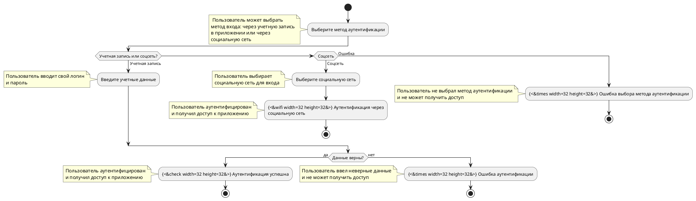

# BPM

## Перечень бизнес-процессов

| № | Код           | Наименование                |
|---|---------------|-----------------------------|
| 1 | [BP-001-Reg]  | Регистрация пользователя    |
| 2 | [BP-001-Auth] | Аутентификация пользователя |
|   |               |                             |
|   |               |                             |
|   |               |                             |

## Описание бизнес-процессов

### Регистрация пользователя {id = 'BP-001-Reg'}

### Аутентификация пользователя {id = 'BP-001-Auth'}

